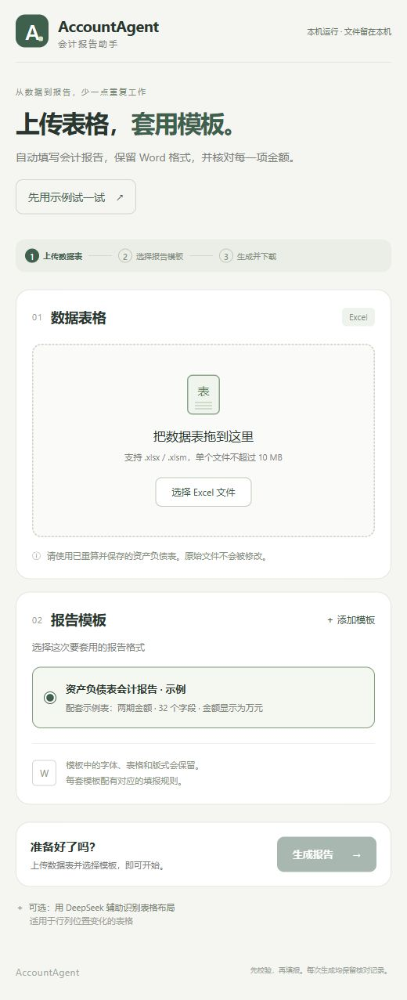

# 中文操作界面



## 打开界面

Windows 双击项目根目录的 `run_ui.bat`。首次会创建项目虚拟环境并安装已有依赖，然后在浏览器打开本机界面。需要 Python 3.10 或以上；启动失败时窗口会保留错误信息。

已安装依赖的环境，也可在完整项目目录运行：

```sh
python -m accounting_report ui
```

浏览器地址是 `http://127.0.0.1:8765`。保持启动窗口打开，按 Ctrl+C 关闭服务。如果端口已被占用，可以指定 `--port 8766`。使用 `--no-browser` 可只启动服务，不自动打开浏览器。安装为命令行工具后，也需在有 `examples/` 的完整项目目录启动，或用 `--project` 指定该目录。

## 日常使用

1. 点击“选择 Excel 文件”，或把数据表拖入上传区，支持 `.xlsx/.xlsm`，单个文件最多 10 MB。
2. 选择要套用的报告模板。
3. 点击“生成报告”。程序先核对科目、公司、日期、单位、金额和勾稽关系，再填写 Word。
4. 成功后点击“下载 Word 报告”。核对日志和报告可分别下载，也可打包下载。打开 Word 检查最终版面。

“先用示例试一试”始终使用内置示例表和示例模板，不使用当前上传的文件或 AI，方便首次体验。示例只用于演示，不是任意企业的通用填报规则。

失败时页面列出检查原因，不能下载未通过验证的报告；已生成的失败核对日志仍可下载。常见原因包括所选模板的公司、日期或单位与 Excel 不符，缺少科目、重复科目，以及公式没有保存计算缓存。Excel 中的公式需先重算并保存；程序不会运行宏或刷新公式。

## 添加自己的模板

点击“添加模板”，填写名称，选择 `.docx` Word 模板和与它配套的 `.json` 填报规则，再点击“保存模板”。保存后它会出现在模板列表中，下次重启界面仍可选择。

每套模板首次需要完成科目、日期、单位、Word 填入目标和勾稽关系的配置，具体见 [配置说明](configuration.md)。添加一个空白 Word 文件本身不能自动创建可靠的填报规则；添加时检查文件与配置格式，金额和 Word 目标的完整一致性会在生成时检查。接入完成后的日常使用只需选模板。

界面不提供在线修改规则或日期的复杂表单。更换公司、期间或模板口径时，应更新配套规则和 Word 静态文字，再作为新模板添加；避免静默修改已保存的模板。

## 可选 DeepSeek

无需 AI 即可按已配置模板填报。布局改变时，可以展开页面下方“用 DeepSeek 辅助识别表格布局”。先按 [DeepSeek 接入说明](deepseek.md) 在本机设置 `DEEPSEEK_API_KEY`，再从同一 PowerShell 启动界面。界面不采集或保存 API key。

勾选“启用 AI 识别”后，模型会提出科目、金额位置及判断依据。页面显示核对表，确认科目、期初期末及位置后，勾选确认并点击“确认并生成报告”；本地预演及金额验证全部通过才生成 Word。数值单元格、可解析的纯文本金额以及公式内容隐藏；科目、表头、公司文字、普通文本和坐标会发送给 DeepSeek。普通文字仍可能含有数字或业务信息。AI 操作使用默认 `deepseek-v4-pro` 和扫描范围 `A1:AZ200`；更复杂的表可以使用命令行调整范围。

## 文件保存和适用范围

- 界面只绑定 `127.0.0.1`，供本机个人使用，没有云端上传或外部托管服务。可选 AI 是明确启用后才发起的外部请求。
- 上传文件、模板快照、建议和报告保存在 `results/ui/runs/`，已添加模板保存在 `results/ui/templates/`，这些内容均已被 Git 忽略，不会随源码上传。
- 关闭或刷新页面不会删除本机文件。重启服务后模板保留，但本次下载链接和 AI 待确认状态不会恢复；可重新上传生成，历史文件仍在本机目录。
- 没有账号系统、多人共享、模板删除或历史管理功能；适合当前的本机简易填报流程。
- 上传文件按固定内部名称保存，不使用用户文件名作为路径；单个文件最大 10 MB，Office 文件解压内容最大 100 MB。请求校验本机来源及会话令牌，禁止任意文件路径下载。

服务使用 Python 标准库的 [ThreadingHTTPServer](https://docs.python.org/3/library/http.server.html) 和项目已有依赖，界面静态文件随 Python 包一起分发。此界面定位为本机工具，不作为互联网服务部署。
